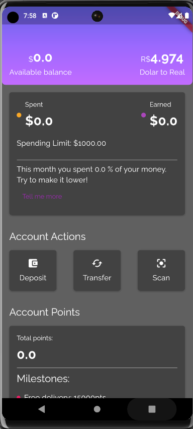

# Aplicando testes de unidade de widgets e mocks

Este projeto é fruto do curso de 'Flutter : Aplicando testes de unidade de widgets e mocks da plataforma ALURA

<!---->

<table style="width: 100%; border-collapse: collapse;" border="0">
  <tr>
    <td style="border: none;"> </td>
    <td style="border: none;">
     
     Este aplicativo não faz a atualização de forma automática de seus componentes em função simulação da movimentação bancária. Isso é proposital para diminuir a complexidade dos testes já que não se trata de um curso avançado.
     
     
     Aqui se faz necessário inicial clicando no botão 'deposit' onde sua conta sera acrescida de U$10 e em seguida necessário clicar nos demais objetos para que se veja a atualização do saldo, pontos etc.. O mesmo vale para transferências.
     
     </td>
   
  </tr>
</table>