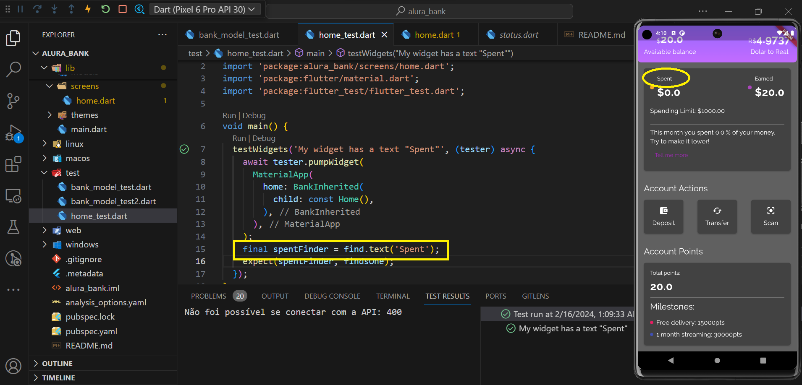
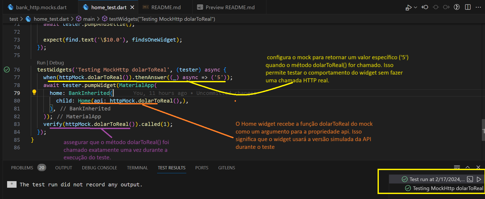

# Aplicando testes de unidade de widgets e mocks

Este projeto é fruto do curso de 'Flutter : Aplicando testes de unidade de widgets e mocks da plataforma ALURA

<table style="width: 100%; border-collapse: collapse;" border="0">
  <tr>
    <td style="border: none;"> </td>
    <td style="border: none;">
     
     Este aplicativo não faz a atualização de forma automática de seus componentes em função simulação da movimentação bancária. Isso é proposital para diminuir a complexidade dos testes já que não se trata de um curso avançado.
     
     
     Aqui se faz necessário inicial clicando no botão 'deposit' onde sua conta sera acrescida de U$10 e em seguida necessário clicar nos demais objetos para que se veja a atualização do saldo, pontos etc.. O mesmo vale para transferências.
     
     </td>
  </tr>
</table>

  ## Primerio Teste (Unidade)

   Nesse teste foi verificado se o valor recebido pela propriedade 'points' do metodo 'deposit' da classe BankModel é identico a entrada. Nesse caso o valor de entrada foi de 10 e o valor da esperdo pela varivél tambem é 10.

   No segundo caso foi feita uma simulação de alteração de codigo o que gerou o erro.

<table style="width: 100%; border-collapse: collapse;" border="0">
  <tr?>
    <td style="border: none;"> </td>
    </tr>
    <td style="border: none;"> </td>
    </tr>
    <tr> 
     <td style="border: none;"> </td>
  </tr>
</table>

  ## Segundo Teste (Widget)

  Neste teste abaixo, o que está sendo verificado é a existencia do texto 'Spent' dentro de todos os widgets usados por Home()

  obs: no caso, a busca para na primeira ocorrência 'findsOneWidget'

  <table style="width: 100%; border-collapse: collapse;" border="0">
  <tr?>
    <td style="border: none;"> </td>
    </tr>
    <td style="border: none;"> </td>
    </tr>
    <tr> 
     <td style="border: none;"> 
     </td>
  </tr>
  <tr> 
     <td style="border: none;"> 
     </td>
  </tr>
</table>

 Busca pela chave unica de um widget (widget key)

 

 Busca por repetições do widget (BoxCard)

 

Tester para Ação 'Deposit' e atualização do card 'RecentActivity'

### Simulação de API externa usando um dublê (mockito)

 Ao fazermos testes a conexão a api externa, esta não é realizada de forma correta devido ao tempo de conexão o que pode induzir a um erro que é chamado de 'Fake test', 'Fake' porque o erro não esta na aplicação mas sim a fatores externos que pode falhar ou não.

 A solução para isso é usar uma tecnica chamada de 'dublê' onde são usados componentes especificos para isso (mock,stub entre outros ) .

 No caso da aplicação foi usado um 'mock', gerado através do Mockito, que será o duble da API (BankHttp)

 https://pub.dev/packages/mockito

 Após feita a instalação, e gerado o Mock, e é necessário se fazer uma adaptação no codigo devido a todo test ser baseado na renderização de 'Home' que aciona Header que por sua vez aciona 'BankHttp().dolarToReal()'.

 obs: apenas na chamada via 'home()' é feita a adaptação do doublê, na chamada por 'main()' é mantida a api.

  <table style="width: 100%; border-collapse: collapse;" border="0">
  <tr?>
      <td style="border: none;"> </td>
    </tr>
    <td style="border: none;"> </td>
    </tr>
      <tr> 
     <td style="border: none;"> 
     </td>
  </tr>
    <tr> 
     <td style="border: none;"> 
     </td>
  </tr>
  <tr> 
     <td style="border: none;"> 
     </td>
  </tr>
</table>

### Validação final

